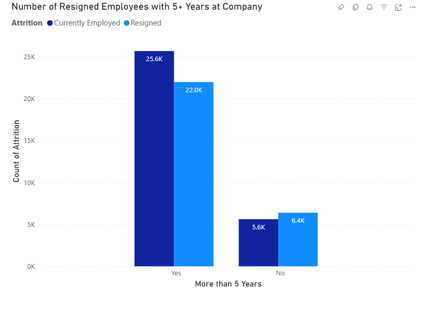

# **Data Analyst | Business Analyst**  
**Technical Skills:** Python (Pandas, NumPy, SciPy, Matplotlib, Seaborn), Tableau, Knime, Microsoft Power BI, MySQL  

---

## **Projects**  

### **[Sentiment Analysis of Movie Critic Reviews](https://github.com/Ngobt/Critic-Review-Analysis)**  
**Summary:** Leveraged Python and Power BI to analyze and visualize sentiment trends in a dataset of 27,000+ movie critic reviews.  
**Tools:** Python, SQL, Power BI  

- **Data Cleaning and Transformation:** Cleaned and standardized a dataset of 27,000+ movie critic reviews, addressing missing values, normalizing scores, and transforming inconsistent data formats to enable seamless SQL querying and analysis.  
- **SQL Queries:** Used SQL to extract insights such as the average sentiment by genre, top critics based on positive reviews, and publication trends across different platforms.  
- **Visualization:** Developed an interactive Power BI dashboard visualizing sentiment trends, critic behaviors, and publication patterns, integrating dynamic slicers for filtering by genre, time period, and sentiment polarity.  
- **Impact:** Enhanced stakeholder decision-making by providing actionable insights into critic behaviors, review trends, and patterns in movie ratings across genres and platforms.

---

### **Predictive Insights for Employee Retention**  
**Summary:** Predicted employee attrition and satisfaction to help organizations improve retention strategies.  
**Tools:** Python, Power BI  

- Used Python for data preprocessing and machine learning to analyze factors contributing to employee turnover and satisfaction.  
- Developed visual dashboards in Power BI to present findings clearly to HR and leadership teams.  
- Applied Scrum methodology to iteratively refine insights and align deliverables with business needs.  
- Presented actionable recommendations to reduce turnover and enhance employee engagement.  

 

---
### **NYC Restaurant Inspection Analysis**  
**Summary:** Used NYC’s open data to analyze health inspection results and improve food safety transparency.  
**Tools:** Python, Jupyter Notebook  

- Cleaned and prepared inspection data using Python libraries (Pandas, Matplotlib) to enable a deeper analysis of health violations and grades.  
- Built predictive models to identify factors associated with high-performing restaurants and recurring violations.  
- Designed visualizations that highlighted key trends and insights for stakeholders.  
- Compiled recommendations to improve health and safety compliance in NYC restaurants.

---

### **Customer Behavior Analytics for CarMax**  
**Summary:** Explored customer transaction data to uncover patterns in vehicle trade-ins and purchases.  
**Tools:** Knime, Tableau  

- Analyzed ~130,000 customer records to identify factors impacting vehicle purchases, such as trade-in trends and customer preferences.  
- Applied machine learning techniques like decision trees and clustering to extract key insights.  
- Created interactive visualizations using Tableau, adhering to Tufte’s data/ink principles for clear and impactful storytelling.  
- Delivered actionable recommendations in a detailed report and presentation to enhance customer experiences and operational strategies.

---

### **SQL Database System for an Ice Cream Truck Business**  
**Summary:** Designed a comprehensive database system to help a hypothetical ice cream truck business manage operations more efficiently.  
**Tools:** Oracle SQL  

- Built a relational database normalized to the third normal form, ensuring data integrity and minimizing redundancy.  
- Developed a 12-entity Enhanced Entity-Relationship Diagram (EERD) and a detailed data dictionary to align with user requirements and business rules.  
- Wrote SQL scripts to define tables, establish relationships, and populate the database with test data.  
- Crafted 15 complex SQL queries, including multi-table joins, to provide actionable insights for business decisions, all tested and documented in Oracle Application Express.

---

## **Let’s Connect!**  
Explore more about my work through my [Portfolio](https://ngobt.github.io/portfolio/) or connect with me on [LinkedIn](https://linkedin.com/in/brandonngo24).  

---
